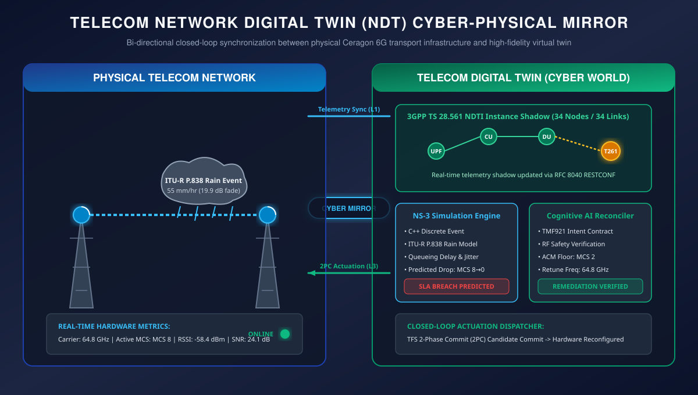
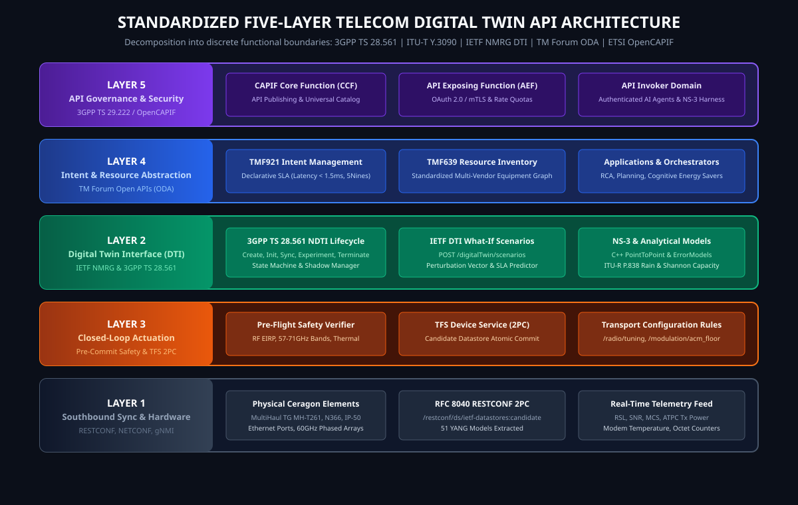
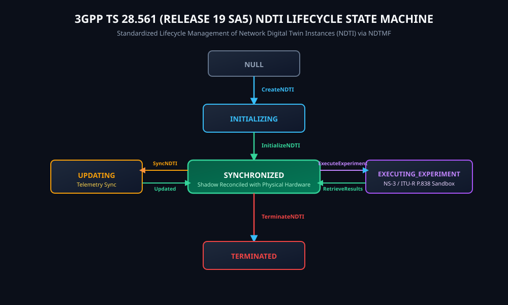
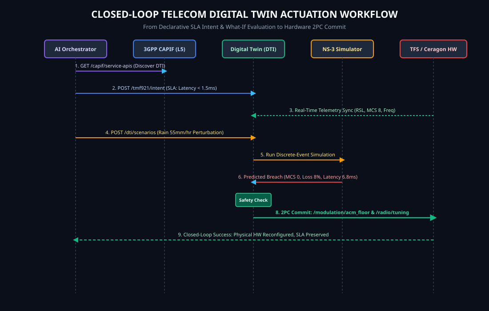
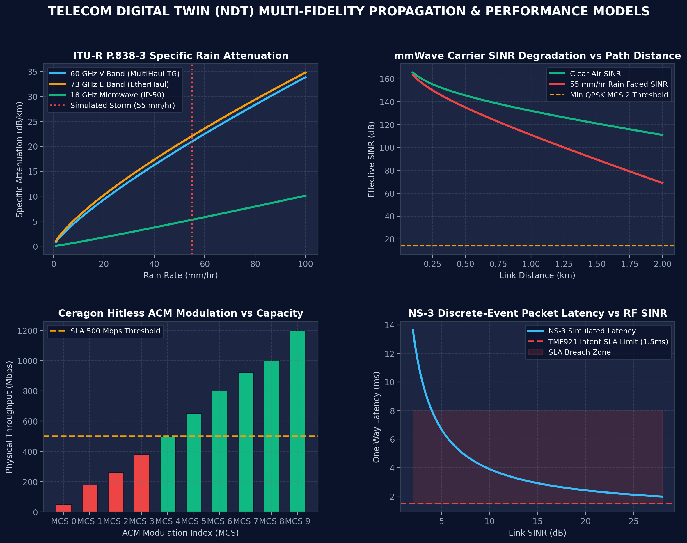

# TFS-NS3 Telecom Network Digital Twin (NDT) Framework

[](https://opensource.org/licenses/Apache-2.0)
[](https://www.python.org/)
[](docs/STANDARDS_COMPLIANCE.md)
[](https://www.nsnam.org/)
[](https://labs.etsi.org/rep/tfs)

A standardized, carrier-grade **Telecom Network Digital Twin (NDT)** framework and runtime co-simulation bridge connecting **ETSI TeraFlowSDN (TFS)** with discrete-event network simulators (**NS-3**), cognitive AI optimization engines, and intent orchestrators.

---

## 1. High-Level Cyber-Physical Mirror

The platform establishes a bi-directional reflection plane between the physical telecommunications network and a real-time, predictive cyber twin:

<p align="center">
  
</p>

- **Real-Time Telemetry Mirroring**: Live physical Ceragon hardware states (carrier frequency, active ACM modulation, RSSI, SNR, ATPC transmit power, and modem temperatures) are continuously synchronized into the twin's shadow datastore via RFC 8040 RESTCONF.
- **Predictive Risk-Free Sandbox**: External perturbations (severe ITU-R P.838 mmWave rain fade, bursty traffic surges, link failures) are simulated within the digital twin sandbox prior to executing physical changes.
- **Autonomic Closed-Loop Actuation**: When SLA boundary breaches are predicted, the twin formulates and safety-validates corrective configurations, committing them to physical hardware via ETSI TeraFlowSDN's 2-Phase Commit (2PC) engine.

---

## 2. Global Standardization Anchors

The architecture adheres to international telecommunications standards to prevent vendor lock-in and ensure interoperability:

| Organization | Specification | Functional Scope & Architectural Role |
| :--- | :--- | :--- |
| **3GPP** | **TS 28.561** (Release 19 SA5) | **Network Digital Twin Management**: Governs the Network Digital Twin Instance (NDTI) lifecycle state machine, data exposure interfaces, and experimental execution. |
| **3GPP** | **TR 28.915** | Preceding study detailing foundational NDT use cases, requirements, and mappings to 3GPP Management Services (MnS). |
| **ITU-T** | **Y.3090** | **Digital Twin Network (DTN) Reference Architecture**: Defines the 4-plane model (Physical Network, Twin Data, Twin Model, Network Application) with open NBI/SBI. |
| **IETF / IRTF** | `draft-irtf-nmrg-network-digital-twin-arch` | Outlines Internet & transport-oriented NDT models, cleanly separating telemetry collection from scenario simulation. |
| **IETF / IRTF** | `draft-paillisse-nmrg-performance-digital-twin-02` | **The Digital Twin Interface (DTI)**: Formalizes the scenario evaluation contract (`POST /digitalTwin/scenarios`), input perturbation schemas, and predicted outputs. |
| **IETF / IRTF** | `draft-zcz-nmrg-digitaltwin-data-collection` | Standardizes SBI data collection bindings (NETCONF, RESTCONF, gNMI, YANG Push, IPFIX, and INT). |
| **ETSI** | **TS 104 296** | NDT for Deterministic Network Testing; specifies formal models and testing interfaces. |
| **TM Forum** | **ODA Open APIs** | **Northbound Intent & Inventory**: TMF921 (Intent Management), TMF639 (Resource Inventory), TMF640 (Service Activation), and TMF642 (Alarm Management). |
| **3GPP / ETSI** | **TS 29.222 / OpenCAPIF** | **API Exposure & Governance**: Common API Framework (CAPIF) providing universal API publishing, catalog discovery, OAuth 2.0 / mTLS security, and invocation auditing. |

---

## 3. The Five-Layer API Architecture

A core finding of this framework is that **the digital twin API and the device management API are not the same.** The system delineates operational responsibilities across five distinct API boundaries:

<p align="center">
  
</p>

### API Layer Taxonomy

1. **Layer 1: Southbound Synchronization (Physical Network $\rightarrow$ Digital Twin)**
   - *Protocols*: RFC 8040 RESTCONF (`/restconf/ds/ietf-datastores:candidate` & operational datastore), RFC 6241 NETCONF, gNMI, YANG Push (RFC 8641/8639), and streaming WebSocket/SSE.
   - *Data*: RF carrier frequencies (57–71 GHz V-Band, 70/80 GHz E-Band), Adaptive Coding & Modulation (ACM) MCS indices, RSL/RSSI, SNR/SINR, ATPC transmit power, and modem temperatures.
2. **Layer 2: Digital Twin Interface (DTI - Model & Simulation Interaction)**
   - *Standards*: IETF NMRG DTI & 3GPP TS 28.561.
   - *Endpoints*: `POST /api/v1/dti/scenarios` (What-if scenario perturbation evaluation).
   - *Engines*: NS-3 discrete-event C++ co-simulation engine + ITU-R P.838 rain fade propagation models.
3. **Layer 3: Closed-Loop Network Actuation (Digital Twin $\rightarrow$ Physical Control)**
   - *Gatekeeper*: Pre-commit safety validation (RF frequency bands, minimum ACM floors, thermal limits).
   - *Transactional Dispatch*: Pushes verified configuration rules into ETSI TeraFlowSDN's 2-Phase Commit (2PC) candidate datastore (`/radio/tuning`, `/modulation/acm_floor`, `/slice/*`).
4. **Layer 4: Northbound Intent & Inventory Abstraction (TM Forum ODA)**
   - *TMF921 Intent Management*: Ingests declarative business contracts (e.g. *“Ensure latency < 1.5ms and availability > 99.999% during adverse weather”*).
   - *TMF639 Resource Inventory*: Projects synchronized physical and virtual equipment into standardized `PhysicalResource` entities.
5. **Layer 5: API Exposure, Governance & Security (3GPP CAPIF / ETSI OpenCAPIF)**
   - *CAPIF Core Function (CCF)*: Central publishing catalog for digital twin APIs (`TelecomDigitalTwin_DTI_API`).
   - *API Exposing Function (AEF)*: Enforces mutual TLS (mTLS), OAuth 2.0 bearer tokens, rate limiting, and access control.

---

## 4. 3GPP TS 28.561 NDTI Instance Lifecycle

Network Digital Twin Instances (NDTI) are managed by the Network Digital Twin Management Function (NDTMF) through a formal lifecycle state machine:

<p align="center">
  
</p>

- **`CreateNDTI` (`NULL` $\rightarrow$ `INITIALIZING`)**: Allocates instance shadow structures and registers the NDTI ID.
- **`InitializeNDTI` (`INITIALIZING` $\rightarrow$ `SYNCHRONIZED`)**: Populates baseline topology (34 O-RAN transport nodes) and initial RF parameters from TFS.
- **`SyncNDTI` (`SYNCHRONIZED` $\leftrightarrow$ `UPDATING`)**: Periodically or event-driven reconciles live measurements from physical hardware.
- **`ExecuteExperiment` (`SYNCHRONIZED` $\leftrightarrow$ `EXECUTING_EXPERIMENT`)**: Ingests what-if perturbations and executes discrete-event simulations in NS-3.
- **`TerminateNDTI` (`ANY` $\rightarrow$ `TERMINATED`)**: Gracefully tears down twin resources and archives logs.

---

## 5. Closed-Loop Actuation Workflow

The following sequence diagram details the end-to-end closed-loop interaction from high-level intent declaration down to hardware actuation:

<p align="center">
  
</p>

1. **CAPIF Discovery**: The cognitive AI agent authenticates with CAPIF (`GET /api/v1/capif/service-apis`) and discovers available DTI endpoints.
2. **Intent Ingestion**: The agent declares a TMF921 SLA Intent: *Latency $\le$ 1.5ms, Availability $\ge$ 99.999%*.
3. **Background Sync**: Layer 1 continuously synchronizes live hardware telemetry (MCS 8, 64.8 GHz carrier, -58.4 dBm RSSI).
4. **What-If Scenario Evaluation**: A severe 55 mm/hr rain storm is submitted to the digital twin (`POST /api/v1/dti/scenarios`).
5. **NS-3 Simulation**: NS-3 calculates 19.93 dB rain attenuation, predicting modulation collapse to MCS 0 and buffer overflow queueing latency of 6.77 ms (**SLA Breach Predicted**).
6. **Safety Pre-Flight Verification**: The cognitive agent computes a mitigation plan (RF retuning to Channel 4 + ACM floor hardening to MCS 2 + URLLC slice reservation). The twin validates the plan against RF safety envelopes.
7. **2PC Candidate Commit**: The validated configuration is dispatched via ETSI TeraFlowSDN's 2-Phase Commit engine to the physical Ceragon device datastore, averting the outage before it impacts live user traffic.

---

## 6. Multi-Fidelity Propagation & Performance Models

The digital twin combines ITU-R theoretical propagation models with NS-3 discrete-event queueing simulations:

<p align="center">
  
</p>

- **ITU-R P.838-3 Specific Rain Attenuation**: Calculates $\gamma_R = k \cdot R^\alpha$ across 60 GHz V-Band, 73 GHz E-Band, and 18 GHz Microwave.
- **mmWave Carrier SINR Degradation**: Models path loss ($FSPL$), oxygen absorption peak ($\sim 15\text{ dB/km}$ at 60 GHz), and rain fade over distance.
- **Hitless ACM State Machine**: Dynamically switches modulation from MCS 12 down to MCS 0 (BPSK) to preserve link availability at the cost of reduced throughput.
- **NS-3 Discrete-Event Packet Latency**: Models packet buffer occupancy and end-to-end transmission delay, identifying the exact SINR threshold where SLA boundaries are violated.

---

## 7. Repository Structure

```
tfs-ns3-digital-twin/
├── README.md                      # Primary documentation & visual guide
├── LICENSE                        # Apache 2.0 open-source license
├── requirements.txt               # Dependencies (requests, matplotlib, numpy)
├── generate_figures.py            # Scientific & architectural figure generator
├── figures/                       # Vector & raster diagram assets
│   ├── digital_twin_mirror_concept.svg
│   ├── telecom_ndt_5layer_architecture.svg
│   ├── 3gpp_ts28561_ndti_lifecycle.svg
│   ├── closed_loop_sequence_diagram.svg
│   └── rain_attenuation_and_acm_curves.png
├── src/                           # Core framework package
│   ├── __init__.py
│   ├── tfs_digital_twin_api.py    # 5-Layer Telecom Digital Twin REST Server
│   ├── tfs_api_client.py          # Northbound REST API client for TFS
│   ├── tfs_topology_to_ns3.py     # C++ NS-3 scenario & topology generator
│   └── ns3_tfs_runtime_bridge.py  # Runtime co-simulation daemon (:9099)
├── examples/                      # Verification harnesses
│   ├── demo_telecom_digital_twin.py # Complete 7-step digital twin demonstration
│   └── demo_ns3_tfs_control.py      # Telemetry extraction & control dispatch
├── data/                          # Topology descriptors
│   └── 6g_transport_tfs_descriptors.json # 34-Node O-RAN transport network
├── docs/                          # Detailed architecture specifications
│   ├── ARCHITECTURE.md            # Deep dive into the 5-layer API stack
│   ├── STANDARDS_COMPLIANCE.md    # Mapping table for 3GPP, ITU-T, IETF, TMF
│   └── OPENAPI_SPECIFICATION.yaml # OpenAPI 3.1 REST API schema
└── tests/                         # Unit tests
    ├── __init__.py
    └── test_digital_twin.py       # Automated test suite
```

---

## 8. Quickstart & Demonstration

### 1. Installation
```bash
git clone https://github.com/efidvir/tfs-ns3-digital-twin.git
cd tfs-ns3-digital-twin
pip install -r requirements.txt
```

### 2. Run the End-to-End Digital Twin Demonstration
Executes all 7 steps of the closed-loop workflow:
```bash
python demo_telecom_digital_twin.py
```

### 3. Launch the Standalone Digital Twin REST API Server
```bash
python tfs_digital_twin_api.py 9100
```

### 4. Run Unit Tests
```bash
python -m unittest tests/test_digital_twin.py
```

### 5. Generate NS-3 C++ Simulation Scenarios
```bash
# Ingest active topology from TFS (or local descriptors) and generate NS-3 C++ code
python tfs_topology_to_ns3.py --context admin --topology admin --wireless --traffic --output scratch/tfs_sim.cc
```

---

## 9. REST API Reference (OpenAPI 3.1 Highlights)

| Method | Endpoint | Standard | Description |
| :--- | :--- | :--- | :--- |
| `GET` | `/api/v1/capif/service-apis` | 3GPP TS 29.222 | Returns OpenCAPIF service discovery descriptor. |
| `POST` | `/api/v1/dti/instances` | 3GPP TS 28.561 | Creates and initializes a new NDTI instance. |
| `POST` | `/api/v1/dti/sync` | ITU-T Y.3090 | Synchronizes twin shadow with physical hardware via TFS. |
| `POST` | `/api/v1/dti/scenarios` | IETF NMRG DTI | Evaluates what-if scenario perturbations in NS-3. |
| `POST` | `/api/v1/dti/validate-and-commit` | TFS 2PC | Safety-checks candidate mitigation and actuates physical network. |
| `POST` | `/api/v1/tmf/tmf921/intent` | TM Forum ODA | Ingests high-level declarative SLA intents. |
| `GET` | `/api/v1/tmf/tmf639/resource` | TM Forum ODA | Returns standardized resource inventory projection. |

---

## 10. Citation & Attribution

If using this framework in academic research or industrial implementations, please cite:
```bibtex
@software{dvir2026tfs_ns3_digital_twin,
  author = {Dvir, Efi},
  title = {{TFS-NS3 Telecom Network Digital Twin (NDT) Framework}},
  url = {https://github.com/efidvir/tfs-ns3-digital-twin},
  year = {2026},
  note = {Standards-based 3GPP TS 28.561, ITU-T Y.3090, and IETF NMRG DTI Co-Simulation}
}
```
