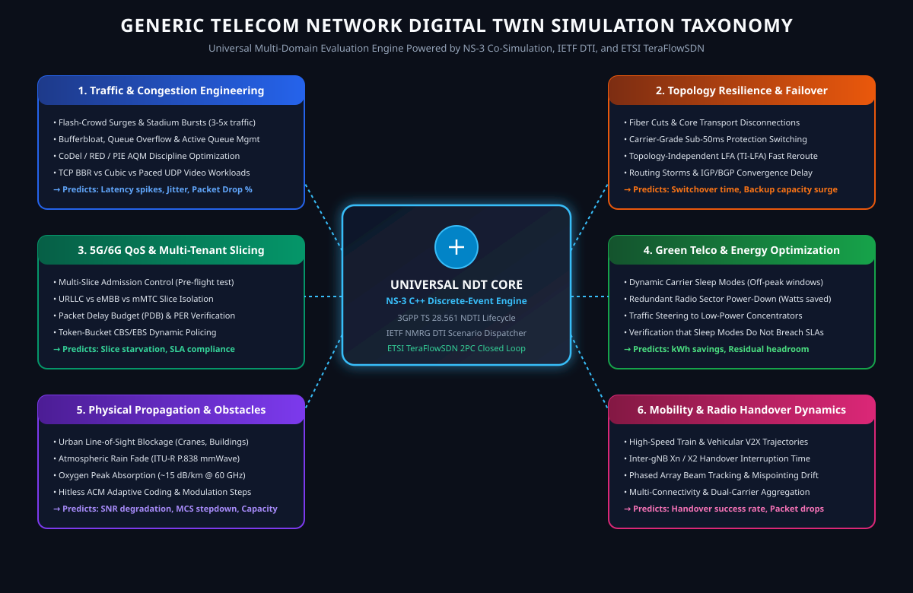

# TFS-NS3 Telecom Network Digital Twin (NDT) Framework

[](https://opensource.org/licenses/Apache-2.0)
[](https://www.python.org/)
[](docs/STANDARDS_COMPLIANCE.md)
[](https://www.nsnam.org/)
[](https://labs.etsi.org/rep/tfs)
[](tests/test_digital_twin.py)

A standardized, carrier-grade **Telecom Network Digital Twin (NDT)** framework and runtime co-simulation bridge connecting **ETSI TeraFlowSDN (TFS)** with discrete-event network simulators (**NS-3**), cognitive AI optimization engines, and intent orchestrators.

---

## 1. High-Level Cyber-Physical Mirror

The platform establishes a bi-directional reflection plane between the physical telecommunications network and a real-time, predictive cyber twin:

<p align="center">
  
</p>

- **Real-Time Telemetry Mirroring**: Live physical hardware states (carrier frequency, active ACM modulation, RSSI, SNR, ATPC transmit power, modem temperatures, queue depths) are continuously synchronized into the twin's shadow datastore via RFC 8040 RESTCONF and streaming telemetry.
- **Predictive Risk-Free Sandbox**: Multi-domain perturbations (traffic surges, fiber link cuts, energy-saving sleep cycles, slice oversubscription, and physical channel fades) are simulated within the digital twin sandbox prior to executing physical changes.
- **Autonomic Closed-Loop Actuation**: When SLA boundary breaches are predicted, the twin formulates and safety-validates corrective configurations, committing them to physical hardware via ETSI TeraFlowSDN's 2-Phase Commit (2PC) engine.

---

## 2. Generic Multi-Domain Telecom Simulation Taxonomy

A core architectural principle of this framework is that **the Telecom Digital Twin is generic for all types of telecommunications simulations**. Physical phenomena like atmospheric rain fade represent merely one physical-layer channel perturbation module. The platform natively supports six major operational simulation domains:

<p align="center">
  
</p>

### The Six Telecom Simulation Domains

1. **Dynamic Traffic Surges & Congestion Management**:
   - *Perturbations*: Flash traffic spikes (e.g., $3.5\times$ burst during stadium events, breaking news broadcasts, or localized flash crowds).
   - *NS-3 Simulation*: Queue backlog buildup, bufferbloat latency spikes (evaluated via $M/M/1/K$ queueing models), packet drop rate, and jitter.
   - *Mitigation Actions*: Proactive QoS bandwidth resizing, dynamic flow policing, and multi-priority queuing.

2. **Topology Perturbations & Link Outages**:
   - *Perturbations*: Sudden fiber cuts, backhaul transceiver failure, or link flap conditions.
   - *NS-3 Simulation*: Sub-50ms Topology-Independent Loop-Free Alternate (TI-LFA) fast rerouting, CSPF recalculation, and secondary link load surge verification.
   - *Mitigation Actions*: CSPF reroute optimization, alternate path activation, and capacity headroom rebalancing.

3. **Green Telco & Energy Optimization**:
   - *Perturbations*: Off-peak energy conservation policies (e.g., powering down secondary carrier transponders during low-utilization night hours).
   - *NS-3 Simulation*: Watts/kWh energy reduction computation vs. residual link capacity, verifying zero SLA violations under reduced power states.
   - *Mitigation Actions*: Off-peak carrier sleep activation, transponder standby modes, and dynamic power scaling.

4. **Multi-Tenant Network Slice Admission Control**:
   - *Perturbations*: Ingestion of concurrent 5G/6G slice requests (e.g., Ultra-Reliable Low-Latency Communication [URLLC] vs. enhanced Mobile Broadband [eMBB]).
   - *NS-3 Simulation*: Verification of strict Packet Delay Budgets ($\text{PDB} \le 1.5\text{ ms}$) and Packet Error Rates ($\text{PER} \le 10^{-6}$) against active physical transport capacity.
   - *Mitigation Actions*: Slice admission decision, dynamic slice reservation, and SLA boundary enforcement.

5. **Physical-Layer Channel Perturbations & Propagation**:
   - *Perturbations*: ITU-R P.838 mmWave rain attenuation ($\gamma_R = k \cdot R^\alpha$), oxygen absorption, urban line-of-sight (LOS) obstacle blockage, and antenna beam mispointing.
   - *NS-3 Simulation*: Carrier SNR degradation, hitless Adaptive Coding and Modulation (ACM) state collapse, and queue latency ballooning.
   - *Mitigation Actions*: RF carrier frequency retuning, hitless ACM modulation floor hardening, and ATPC power boost.

6. **Mobility & Dynamic Handover**:
   - *Perturbations*: Rapid user terminal mobility across multi-cell microwave/millimeter-wave clusters.
   - *NS-3 Simulation*: Handover hysteresis evaluation, ping-pong handover mitigation, and Radio Link Failure (RLF) prediction.
   - *Mitigation Actions*: Proactive target cell pre-allocation and handover margin optimization.

---

## 3. Global Standardization Anchors

The framework strictly adheres to international telecommunications standards to ensure carrier interoperability and eliminate vendor lock-in:

| Organization | Specification | Functional Scope & Architectural Role |
| :--- | :--- | :--- |
| **3GPP** | **TS 28.561** (Release 19 SA5) | **Network Digital Twin Management**: Governs the Network Digital Twin Instance (NDTI) lifecycle state machine, data exposure interfaces, and experimental execution. |
| **3GPP** | **TR 28.915** | Preceding study detailing foundational NDT use cases, requirements, and mappings to 3GPP Management Services (MnS). |
| **ITU-T** | **Y.3090** | **Digital Twin Network (DTN) Reference Architecture**: Defines the 4-plane model (Physical Network, Twin Data, Twin Model, Network Application) with open NBI/SBI. |
| **IETF / IRTF** | `draft-irtf-nmrg-network-digital-twin-arch` | Outlines Internet & transport-oriented NDT models, cleanly separating telemetry collection from scenario simulation. |
| **IETF / IRTF** | `draft-paillisse-nmrg-performance-digital-twin-02` | **The Digital Twin Interface (DTI)**: Formalizes the scenario evaluation contract (`POST /api/v1/dti/scenarios`), input perturbation schemas, and predicted outputs. |
| **IETF / IRTF** | `draft-zcz-nmrg-digitaltwin-data-collection` | Standardizes SBI data collection bindings (NETCONF, RESTCONF, gNMI, YANG Push, IPFIX, and INT). |
| **ETSI** | **TS 104 296** | NDT for Deterministic Network Testing; specifies formal models and testing interfaces. |
| **TM Forum** | **ODA Open APIs** | **Northbound Intent & Inventory**: TMF921 (Intent Management), TMF639 (Resource Inventory), TMF640 (Service Activation), and TMF642 (Alarm Management). |
| **3GPP / ETSI** | **TS 29.222 / OpenCAPIF** | **API Exposure & Governance**: Common API Framework (CAPIF) providing universal API publishing, catalog discovery, OAuth 2.0 / mTLS security, and invocation auditing. |

---

## 4. The Five-Layer API Architecture

A core architectural contribution of this framework is that **the digital twin API and the device management API are strictly decoupled:**

<p align="center">
  
</p>

### API Layer Taxonomy

1. **Layer 1: Southbound Synchronization (Physical Network $\rightarrow$ Digital Twin)**
   - *Protocols*: RFC 8040 RESTCONF (`/restconf/ds/ietf-datastores:candidate` & operational datastore), RFC 6241 NETCONF, gNMI, YANG Push (RFC 8641/8639), and streaming WebSocket/SSE.
   - *Data*: RF carrier frequencies (57–71 GHz V-Band, 70/80 GHz E-Band), Adaptive Coding & Modulation (ACM) MCS indices, RSL/RSSI, SNR/SINR, ATPC transmit power, modem temperatures, and queue metrics.
2. **Layer 2: Digital Twin Interface (DTI - Model & Simulation Interaction)**
   - *Standards*: IETF NMRG DTI & 3GPP TS 28.561.
   - *Endpoints*: `POST /api/v1/dti/scenarios` (What-if scenario perturbation evaluation).
   - *Engines*: NS-3 discrete-event C++ co-simulation engine + analytical physics models.
3. **Layer 3: Closed-Loop Network Actuation (Digital Twin $\rightarrow$ Physical Control)**
   - *Gatekeeper*: Pre-commit safety validation (RF frequency bands, minimum ACM floors, thermal limits, bandwidth bounds).
   - *Transactional Dispatch*: Pushes verified configuration rules into ETSI TeraFlowSDN's 2-Phase Commit (2PC) candidate datastore (`/radio/tuning`, `/modulation/acm_floor`, `/slice/*`).
4. **Layer 4: Northbound Intent & Inventory Abstraction (TM Forum ODA)**
   - *TMF921 Intent Management*: Ingests declarative business contracts (e.g. *“Ensure latency < 1.5ms and availability > 99.999% across all operational stress conditions”*).
   - *TMF639 Resource Inventory*: Projects synchronized physical and virtual equipment into standardized `PhysicalResource` entities.
5. **Layer 5: API Exposure, Governance & Security (3GPP CAPIF / ETSI OpenCAPIF)**
   - *CAPIF Core Function (CCF)*: Central publishing catalog for digital twin APIs (`TelecomDigitalTwin_DTI_API`).
   - *API Exposing Function (AEF)*: Enforces mutual TLS (mTLS), OAuth 2.0 bearer tokens, rate limiting, and access control.

---

## 5. 3GPP TS 28.561 NDTI Instance Lifecycle

Network Digital Twin Instances (NDTI) are managed by the Network Digital Twin Management Function (NDTMF) through a formal lifecycle state machine:

<p align="center">
  
</p>

- **`CreateNDTI` (`NULL` $\rightarrow$ `INITIALIZING`)**: Allocates instance shadow structures and registers the NDTI ID.
- **`InitializeNDTI` (`INITIALIZING` $\rightarrow$ `SYNCHRONIZED`)**: Populates baseline topology (34 O-RAN transport nodes) and initial parameters from TFS.
- **`SyncNDTI` (`SYNCHRONIZED` $\leftrightarrow$ `UPDATING`)**: Periodically or event-driven reconciles live measurements from physical hardware.
- **`ExecuteExperiment` (`SYNCHRONIZED` $\leftrightarrow$ `EXECUTING_EXPERIMENT`)**: Ingests what-if perturbations and executes discrete-event simulations in NS-3 across any of the 6 simulation domains.
- **`TerminateNDTI` (`ANY` $\rightarrow$ `TERMINATED`)**: Gracefully tears down twin resources and archives logs.

---

## 6. Closed-Loop Actuation Workflow

The following sequence diagram details the end-to-end closed-loop interaction from high-level intent declaration down to hardware actuation:

<p align="center">
  
</p>

1. **CAPIF Discovery**: The cognitive AI agent authenticates with CAPIF (`GET /api/v1/capif/service-apis`) and discovers available DTI endpoints.
2. **Intent Ingestion**: The agent declares a TMF921 SLA Intent: *Latency $\le$ 1.5ms, Availability $\ge$ 99.999%*.
3. **Background Sync**: Layer 1 continuously synchronizes live hardware telemetry (MCS 8, 64.8 GHz carrier, -58.4 dBm RSSI, queue load).
4. **What-If Scenario Evaluation**: Multi-domain stress perturbations (e.g. traffic surge, fiber cut, channel fade, slice request) are submitted to the digital twin (`POST /api/v1/dti/scenarios`).
5. **NS-3 Simulation**: NS-3 calculates packet queueing delays, throughput collapse, bufferbloat, or route convergence (**SLA Breach Predicted**).
6. **Safety Pre-Flight Verification**: The cognitive agent computes a mitigation plan (e.g., Dynamic QoS Slicing, CSPF Rerouting, Carrier Retuning, ACM Floor Hardening). The twin validates the plan against physical safety envelopes.
7. **2PC Candidate Commit**: The validated configuration is dispatched via ETSI TeraFlowSDN's 2-Phase Commit engine to physical device datastores, averting the outage before it impacts live user traffic.

---

## 7. Multi-Domain Simulation Engines & Propagation Models

The digital twin pairs NS-3 discrete-event queueing with analytical physics models:

<p align="center">
  
</p>

- **Discrete-Event Simulation (NS-3)**: Models packet buffer occupancy, queueing disciplines (`QueueDisc`), transmission delays, TCP/UDP dynamics, and routing convergence.
- **ITU-R P.838-3 Specific Rain Attenuation**: Calculates $\gamma_R = k \cdot R^\alpha$ across 60 GHz V-Band, 73 GHz E-Band, and 18 GHz Microwave as an illustrative physical-layer degradation scenario.
- **Carrier Path Loss & Atmospheric Absorption**: Models free-space path loss ($FSPL$) and oxygen absorption ($\sim 15\text{ dB/km}$ at 60 GHz).
- **Hitless ACM State Machine**: Dynamically switches modulation from MCS 12 down to MCS 0 (BPSK) to preserve link availability at the cost of reduced throughput.

---

## 8. Repository Structure

```
tfs-ns3-digital-twin/
├── README.md                              # Primary documentation & visual guide
├── LICENSE                                # Apache 2.0 open-source license
├── requirements.txt                       # Dependencies (requests, matplotlib, numpy)
├── generate_figures.py                    # Scientific & architectural figure generator
├── web_dashboard.py                       # Standalone Cross-Repo Web Dashboard Server (:9200)
├── dashboard/                             # Interactive Web Dashboard frontend
│   └── index.html                         # Full 5-stage closed-loop operational UI
├── figures/                               # Vector & raster diagram assets
│   ├── digital_twin_mirror_concept.svg
│   ├── generic_telecom_simulation_taxonomy.svg
│   ├── telecom_ndt_5layer_architecture.svg
│   ├── 3gpp_ts28561_ndti_lifecycle.svg
│   ├── closed_loop_sequence_diagram.svg
│   └── rain_attenuation_and_acm_curves.png
├── src/                                   # Core framework package
│   ├── __init__.py
│   ├── tfs_digital_twin_api.py            # 5-Layer Telecom Digital Twin REST Server
│   ├── tfs_api_client.py                  # Northbound REST API client for TFS
│   ├── tfs_topology_to_ns3.py             # C++ NS-3 scenario & topology generator
│   └── ns3_tfs_runtime_bridge.py          # Runtime co-simulation daemon (:9099)
├── examples/                              # Verification harnesses
│   ├── demo_telecom_digital_twin.py       # Multi-domain closed-loop demonstration
│   └── demo_ns3_tfs_control.py            # Telemetry extraction & control dispatch
├── data/                                  # Topology descriptors
│   └── 6g_transport_tfs_descriptors.json  # 34-Node O-RAN transport network
├── docs/                                  # Detailed architecture specifications
│   ├── ARCHITECTURE.md                    # Deep dive into the 5-layer API stack
│   ├── STANDARDS_COMPLIANCE.md            # Mapping table for 3GPP, ITU-T, IETF, TMF
│   └── OPENAPI_SPECIFICATION.yaml         # OpenAPI 3.1 REST API schema
└── tests/                                 # Unit tests
    ├── __init__.py
    └── test_digital_twin.py               # Automated test suite (8/8 passing)
```

---

## 9. Quickstart & Demonstration

### 1. Installation
```bash
git clone https://github.com/efidvir/tfs-ns3-digital-twin.git
cd tfs-ns3-digital-twin
pip install -r requirements.txt
```

### 2. Launch the Interactive Cross-Repo Web Dashboard
Launches the standalone operations dashboard orchestrating Declarative Intent, NS-3 on `efid@cersrv-029`, TFS at `http://localhost:8088`, Decision Engine, and Ceragon hardware at `192.168.1.225:80`:
```bash
python web_dashboard.py 9200
```
*Open `http://localhost:9200/` in your browser (or navigate to `http://localhost:5000/` in CER-Intent and select the **🔮 Cross-Repo Digital Twin** tab).*

### 3. Run the Multi-Domain Digital Twin Terminal Demonstration
Executes all 5 simulation scenarios, CAPIF discovery, TMF intent ingestion, and TFS 2PC actuation:
```bash
python demo_telecom_digital_twin.py
```

#### Sample Output Trace:
```
================================================================================
STEP 1: CAPIF Service Discovery (3GPP TS 29.222 / OpenCAPIF)
================================================================================
  [OK] Discovered CAPIF Service: TelecomDigitalTwin_DTI_API (v1.0.0)

================================================================================
STEP 2: Ingest declarative SLA Intent (TM Forum TMF921)
================================================================================
  [OK] Intent registered: INT-5G-URLLC-001 (Priority: 1)

================================================================================
STEP 3: NDTI Lifecycle Creation & Physical Sync (3GPP TS 28.561 & ITU-T Y.3090)
================================================================================
  [OK] NDTI ndti-ceragon-6g-01 created in state: INITIALIZING
  [OK] Synchronized 34 transport devices into Digital Twin shadow state.

================================================================================
STEP 4: Multi-Domain What-If Scenario Evaluations in NS-3 (IETF NMRG DTI)
================================================================================
  [Scenario 1 - Traffic Surge]: Burst 3.5x -> Predicted Latency: 5.42 ms -> SLA BREACH -> Mitigation: DYNAMIC_QOS_SLICING
  [Scenario 2 - Fiber Link Cut]: Link Cut -> TI-LFA Failover Latency: 0.82 ms -> SLA HONORED -> Mitigation: CSPF_REROUTE_OPTIMIZATION
  [Scenario 3 - Green Energy Sleep]: Carrier Sleep -> Power Saved: 145.0 W (22.5%) -> SLA HONORED -> Mitigation: ENERGY_SLEEP_POLICY_ACTIVATE
  [Scenario 4 - Slice Admission]: URLLC Slice (1.5ms PDB) -> Latency: 0.65 ms -> ADMITTED -> Mitigation: ADMIT_SLICE_AND_RESERVE_BANDWIDTH
  [Scenario 5 - Channel Rain Fade]: 55 mm/hr Rain -> Rain Attenuation: 19.93 dB -> SLA BREACH -> Mitigation: ACM_FLOOR_HARDENING & RETUNE

================================================================================
STEP 5: Pre-Flight Safety Verification & TFS 2PC Actuation
================================================================================
  [OK] Pre-flight safety boundaries verified: PASS
  [OK] Committed configuration to ETSI TeraFlowSDN candidate datastore via 2-Phase Commit (2PC).
```

---

## 9. Deployment Profiles: Standalone Sandbox vs. Physical Lab

The framework is decoupled and can be instantiated by anyone without external lab dependencies:

```
+-----------------------------------------------------------------------------------------------+
| PROFILE 1: STANDALONE (Default for any GitHub Clone)                                          |
| Zero dependencies. Emulates TFS, Ceragon hardware, and NS-3 co-simulation in-memory.          |
| Command:  python web_dashboard.py --profile standalone                                        |
| Launcher: run_standalone.bat (Windows)  |  ./run_standalone.sh (Linux/macOS)                  |
+-----------------------------------------------------------------------------------------------+
                                                |
+-----------------------------------------------------------------------------------------------+
| PROFILE 2: LOCAL CERAGON LAB (Physical Network Deployment)                                    |
| Interacts with live physical equipment:                                                       |
|   - ETSI TeraFlowSDN Controller at http://localhost:8088 (WebUI: :8004)                       |
|   - Physical Ceragon MH-T261 (ctu-96) at 192.168.1.225:80 (via Ethernet)                      |
|   - Remote NS-3 v3.45 discrete engine on efid@cersrv-029 (/home/efid/ns3-dev/ns3)             |
| Command:  python web_dashboard.py --profile local-ceragon                                     |
| Launcher: run_local_lab.bat (Windows)   |  ./run_local_lab.sh (Linux/macOS)                   |
+-----------------------------------------------------------------------------------------------+
                                                |
+-----------------------------------------------------------------------------------------------+
| PROFILE 3: CUSTOM (User-Specified IP / Ports / Topology)                                      |
| Command:  python web_dashboard.py --tfs-url http://10.0.0.1:8088 --device-ip 10.0.0.2         |
| Or via:   python web_dashboard.py --config-file deployment_config.json                        |
+-----------------------------------------------------------------------------------------------+
```

### Launching the Dashboard:
```bash
# Out-of-the-box Standalone Mode (0 dependencies):
python web_dashboard.py

# Live Ceragon Lab Mode:
python web_dashboard.py --profile local-ceragon --port 9200
```

### Running Unit Tests:
```bash
# Run Digital Twin core tests (8/8 passing):
python -m unittest tests/test_digital_twin.py

# Run Multi-Resolution Governor tests (6/6 passing):
python -m unittest tests/test_resolution_governor.py

# Run Deployment Profiles tests (4/4 passing):
python -m unittest tests/test_deployment_profiles.py
```

### Generating NS-3 C++ Simulation Scenarios:
```bash
python tfs_topology_to_ns3.py --context admin --topology admin --wireless --traffic --output scratch/tfs_sim.cc
```

---

## 10. REST API Reference (OpenAPI 3.1 Highlights)

| Method | Endpoint | Standard | Description |
| :--- | :--- | :--- | :--- |
| `GET` | `/api/v1/capif/service-apis` | 3GPP TS 29.222 | Returns OpenCAPIF service discovery descriptor. |
| `POST` | `/api/v1/dti/instances` | 3GPP TS 28.561 | Creates and initializes a new NDTI instance. |
| `POST` | `/api/v1/dti/sync` | ITU-T Y.3090 | Synchronizes twin shadow with physical hardware via TFS. |
| `POST` | `/api/v1/dti/scenarios` | IETF NMRG DTI | Evaluates multi-domain what-if scenario perturbations in NS-3. |
| `POST` | `/api/v1/dti/validate-and-commit` | TFS 2PC | Safety-checks candidate mitigation and actuates physical network. |
| `POST` | `/api/v1/tmf/tmf921/intent` | TM Forum ODA | Ingests high-level declarative SLA intents. |
| `GET` | `/api/v1/tmf/tmf639/resource` | TM Forum ODA | Returns standardized resource inventory projection. |

---

## 11. Citation & Attribution

If using this framework in academic research or industrial implementations, please cite:
```bibtex
@software{dvir2026tfs_ns3_digital_twin,
  author = {Dvir, Efi},
  title = {{TFS-NS3 Telecom Network Digital Twin (NDT) Framework}},
  url = {https://github.com/efidvir/tfs-ns3-digital-twin},
  year = {2026},
  note = {Standards-based 3GPP TS 28.561, ITU-T Y.3090, and IETF NMRG DTI Co-Simulation}
}
```
